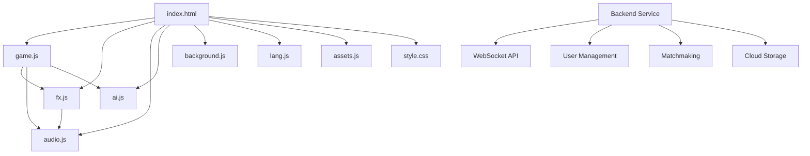

# Design Document

## Overview

Project Lysh 是一款基于 HTML5 Canvas 的现代化五子棋游戏，采用原生 JavaScript 技术栈，具备丰富的视觉特效和技能系统。本设计文档定义了从当前 Alpha 0.7.8.6 版本到 Beta 1.0 版本的完整技术架构和实现方案。

## Architecture

### High-Level Architecture

```
┌─────────────────┐    ┌─────────────────┐    ┌─────────────────┐
│   Presentation  │    │    Business     │    │      Data       │
│     Layer       │    │     Logic       │    │     Layer       │
├─────────────────┤    ├─────────────────┤    ├─────────────────┤
│ • UI Components │    │ • Game Engine   │    │ • Local Storage │
│ • Canvas Render │    │ • Skill System  │    │ • Cloud Storage │
│ • Event Handler │    │ • AI Engine     │    │ • Asset Manager │
│ • FX Engine     │    │ • Match Logic   │    │ • Config Data   │
│ • Audio Engine  │    │ • Tournament    │    │ • User Profile  │
└─────────────────┘    └─────────────────┘    └─────────────────┘
```

### Module Dependencies



## Components and Interfaces

### 1. Visual Effects Engine (fx.js)

**Purpose**: 管理所有视觉特效，包括连珠特效、技能特效、庆祝动画等。

**Key Interfaces**:
```javascript
interface VisualFX {
    // 核心渲染
    renderFrame(timestamp): void
    clear(): void
    
    // 连珠特效
    drawWinLine(cells: Cell[], type: string): void
    
    // 庆祝特效
    startCelebration(type: string): void
    
    // 技能特效
    playSkillEffect(skillName: string, position: Position): void
    
    // 屏幕震动
    triggerScreenShake(intensity: number, duration: number): void
    
    // 水波纹特效
    createRippleEffect(x: number, y: number, intensity: number): void
}
```

### 2. Skin System

**Purpose**: 管理棋子和棋盘的外观资源，支持动态切换。

**Key Interfaces**:
```javascript
interface SkinSystem {
    // 皮肤管理
    loadSkin(type: 'piece' | 'board', skinId: string): Promise<void>
    previewSkin(type: 'piece' | 'board', skinId: string): void
    applySkin(type: 'piece' | 'board', skinId: string): void
    
    // 资源管理
    loadAssets(skinData: SkinData[]): Promise<void>
    getAvailableSkins(type: 'piece' | 'board'): SkinInfo[]
    
    // 偏好保存
    savePreferences(preferences: SkinPreferences): void
    loadPreferences(): SkinPreferences
}
```

### 3. Enhanced Audio Engine (audio.js)

**Purpose**: 扩展现有音频引擎，支持动态音效和更丰富的反馈。

**Key Interfaces**:
```javascript
interface AudioEngine {
    // 现有功能保持不变
    playNote(freq: number, duration: number, type: string): void
    playKick(): void
    playMiss(): void
    playMagicComplete(): void
    
    // 新增功能
    playPieceDropSound(position: Position, intensity: number): void
    playSkillSound(skillName: string): void
    playUIFeedback(action: string): void
    setDynamicVolume(baseVolume: number, intensity: number): void
}
```

### 4. Backend Service Architecture

**Purpose**: 支持联网对战和用户数据管理。

**Key Components**:
- **WebSocket Server**: 实时通信
- **User Management**: 账号系统
- **Matchmaking Service**: 对战匹配
- **Cloud Storage**: 数据同步

**API Design**:
```javascript
// WebSocket Events
interface GameEvents {
    'player-join': (playerId: string) => void
    'move-made': (move: Move) => void
    'skill-used': (skill: Skill, position: Position) => void
    'game-end': (result: GameResult) => void
}

// REST API
interface BackendAPI {
    POST /api/auth/login
    POST /api/auth/register
    GET /api/user/profile
    PUT /api/user/preferences
    GET /api/matchmaking/queue
    POST /api/game/create
}
```

## Data Models

### Game State Model
```javascript
interface GameState {
    board: Cell[][]
    currentPlayer: Player
    gamePhase: 'setup' | 'playing' | 'ended'
    skills: SkillSet
    turnCount: number
    timeRemaining: number
}

interface Cell {
    row: number
    col: number
    piece: Piece | null
    effects: Effect[]
}

interface Piece {
    player: Player
    type: 'normal' | 'enhanced'
    skinId: string
}
```

### Skill System Model
```javascript
interface Skill {
    id: string
    name: string
    description: string
    cooldown: number
    cost: number
    effect: SkillEffect
    visualEffect: string
    audioEffect: string
}

interface SkillSet {
    available: Skill[]
    used: Skill[]
    banned: Skill[]
}
```

### User Profile Model
```javascript
interface UserProfile {
    id: string
    username: string
    level: number
    experience: number
    preferences: UserPreferences
    statistics: GameStatistics
    achievements: Achievement[]
}

interface UserPreferences {
    skins: {
        piece: string
        board: string
    }
    audio: {
        masterVolume: number
        sfxVolume: number
        musicVolume: number
    }
    graphics: {
        effectsQuality: 'low' | 'medium' | 'high'
        particleDensity: number
    }
}
```

## Correctness Properties

*A property is a characteristic or behavior that should hold true across all valid executions of a system-essentially, a formal statement about what the system should do. Properties serve as the bridge between human-readable specifications and machine-verifiable correctness guarantees.*

### Property 1: UI Interaction Feedback
*For any* UI element interaction (hover, click), the UI_Engine should provide appropriate visual feedback animation
**Validates: Requirements 1.1**

### Property 2: Piece Drop Screen Shake
*For any* valid piece placement, the system should trigger screen shake effect with appropriate intensity
**Validates: Requirements 1.2**

### Property 3: Ripple Effect Generation
*For any* piece placement, the FX_Engine should generate water ripple effect at the placement position
**Validates: Requirements 1.3**

### Property 4: Dynamic Audio Feedback
*For any* piece placement, the Audio_Engine should play dynamic sound effect that matches the visual feedback
**Validates: Requirements 1.4**

### Property 5: Skin System Material Support
*For any* supported material type (glowing, 3D, dynamic), the Skin_System should correctly load and render the material
**Validates: Requirements 2.1, 2.2**

### Property 6: Real-time Skin Preview
*For any* skin selection, the system should immediately display preview without requiring confirmation
**Validates: Requirements 2.3**

### Property 7: Skin Preference Persistence
*For any* skin preference setting, saving then loading should restore the exact same preference
**Validates: Requirements 2.5**

### Property 8: Skill-Specific Visual Effects
*For any* skill activation, the FX_Engine should play the unique visual effect associated with that specific skill
**Validates: Requirements 3.1, 3.2, 3.3**

### Property 9: Random Celebration Selection
*For any* game victory, the system should randomly select from available celebration modes with equal probability
**Validates: Requirements 4.1, 4.2**

### Property 10: WebSocket Connection Reliability
*For any* network connection attempt, the Backend_Service should establish stable WebSocket connection or provide clear error feedback
**Validates: Requirements 5.1**

### Property 11: Cross-Platform Matchmaking
*For any* matchmaking request from different platforms (PC/Mobile), the system should successfully pair compatible players
**Validates: Requirements 5.2, 5.3**

### Property 12: Cloud Data Synchronization
*For any* user data, uploading to cloud then downloading should restore identical data
**Validates: Requirements 5.4, 5.5**

### Property 13: AI Decision Time Constraint
*For any* AI move calculation, the AI_Engine should complete decision within 3 seconds regardless of board complexity
**Validates: Requirements 6.4**

### Property 14: AI Skill Utilization
*For any* game situation where skills are available, the AI should demonstrate strategic skill usage
**Validates: Requirements 6.5**

### Property 15: BO3 Tournament Flow
*For any* BO3 tournament, the system should correctly track wins/losses and declare winner after first player reaches 2 wins
**Validates: Requirements 7.1**

### Property 16: Skill Ban/Pick Functionality
*For any* skill ban/pick operation, the system should correctly apply restrictions and selections to both players
**Validates: Requirements 7.3, 7.4**

### Property 17: Tournament Record Keeping
*For any* completed tournament, the system should accurately record all match results and player statistics
**Validates: Requirements 7.5**

### Property 18: Frame Rate Maintenance
*For any* game scenario including complex effects, the system should maintain at least 50 FPS (allowing 10 FPS tolerance from 60 FPS target)
**Validates: Requirements 8.1**

### Property 19: Memory Management Efficiency
*For any* particle effect sequence, the system should reuse objects from pool rather than creating new instances
**Validates: Requirements 8.2, 8.3**

### Property 20: Steam Achievement Integration
*For any* achievement trigger condition, the system should correctly unlock the corresponding Steam achievement
**Validates: Requirements 9.2, 9.4**

### Property 21: Steam Cloud Save Synchronization
*For any* game save data, uploading to Steam Cloud then downloading should restore identical save state
**Validates: Requirements 9.3**

### Property 22: Batch Skin Import
*For any* batch of new skin assets, the Skin_System should successfully import and make them available for selection
**Validates: Requirements 10.2**

## Error Handling

### Client-Side Error Handling
- **Canvas Rendering Errors**: Graceful fallback to simplified rendering
- **Audio Context Errors**: Silent failure with visual-only feedback
- **Asset Loading Errors**: Default asset substitution
- **Performance Degradation**: Automatic quality reduction

### Network Error Handling
- **Connection Loss**: Automatic reconnection with exponential backoff
- **Matchmaking Timeout**: Clear user notification and retry options
- **Data Sync Failures**: Local caching with retry mechanism

### User Input Validation
- **Invalid Moves**: Clear feedback and move rejection
- **Skill Usage Errors**: Cooldown and availability checking
- **Tournament Setup**: Comprehensive validation of all parameters

## Testing Strategy

### Unit Testing
- **Component Isolation**: Test each module independently
- **Mock Dependencies**: Use mocks for external services
- **Edge Case Coverage**: Test boundary conditions and error scenarios
- **Performance Benchmarks**: Validate frame rate and memory usage

### Property-Based Testing
- **Configuration**: Minimum 100 iterations per property test
- **Test Framework**: Use fast-check or similar PBT library for JavaScript
- **Property Validation**: Each correctness property implemented as automated test
- **Tag Format**: **Feature: project-lysh-roadmap, Property {number}: {property_text}**

### Integration Testing
- **End-to-End Flows**: Complete game sessions from start to finish
- **Cross-Browser Testing**: Chrome, Edge, Safari compatibility
- **Network Simulation**: Various connection conditions
- **Steam Integration**: Full Steam SDK functionality

### Performance Testing
- **Load Testing**: Multiple concurrent users
- **Memory Profiling**: Garbage collection impact analysis
- **Frame Rate Monitoring**: Continuous FPS measurement
- **Asset Loading**: Network performance under various conditions

The testing approach combines unit tests for specific functionality with property-based tests for universal correctness guarantees, ensuring both concrete behavior validation and comprehensive input coverage.