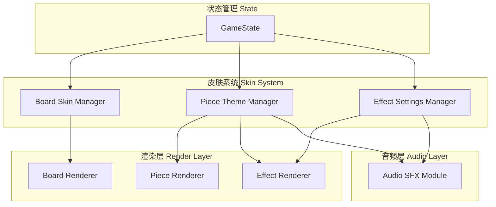

# Design Document: Visual Upgrade 0.7.9.5 - 0.7.9.7

## Overview

本设计文档详细描述了 Project Lysh 三个版本的视觉升级实现方案：
- **Alpha 0.7.9.5**: 国际象棋风格棋盘
- **Alpha 0.7.9.6**: 冰/火主题棋子
- **Alpha 0.7.9.7**: 神圣/邪恶主题棋子

设计遵循现有的 Host + Plugins 架构，确保新功能与现有系统无缝集成。

## Architecture

### 系统架构图




## Components and Interfaces

### 1. 棋盘皮肤系统扩展 (Board Skin Extension)

#### 1.1 GameState 扩展

```javascript
// gamestate.js 新增属性
GameState = {
    // ... 现有属性
    currentBoardSkin: 'classic_wood', // 新增 'chess' 选项
}
```

#### 1.2 CSS 类结构

```css
/* style.css - 国际象棋棋盘皮肤 */
.board.skin-chess {
    /* 棋盘基础样式 */
}

.board.skin-chess .cell {
    /* 格子样式 - 根据位置交替黑白 */
}

.board.skin-chess .cell.chess-white {
    /* 白色大理石格子 */
}

.board.skin-chess .cell.chess-black {
    /* 黑色黑曜石格子 */
}
```

#### 1.3 渲染逻辑

```javascript
// game_render.js - applyBoardSkin() 扩展
function applyBoardSkin() {
    // ... 现有逻辑
    if (currentBoardSkin === 'chess') {
        boardEl.classList.add('skin-chess');
        applyChessPattern(); // 新增：应用棋盘格子图案
    }
}

function applyChessPattern() {
    // 为每个 cell 添加 chess-white 或 chess-black 类
    // 基于 (row + col) % 2 判断
}
```

### 2. 棋子主题系统 (Piece Theme System)

#### 2.1 GameState 扩展

```javascript
// gamestate.js 新增属性
GameState = {
    // ... 现有属性
    currentPieceTheme: 'classic', // 'classic' | 'nature' | 'ice_fire' | 'holy_evil'
    
    // 特效强度设置（每个主题独立）
    pieceEffectSettings: {
        ice_fire: {
            intensity: 'medium', // 'off' | 'low' | 'medium' | 'high'
        },
        holy_evil: {
            intensity: 'medium',
        }
    }
}
```

#### 2.2 CSS 类结构

```css
/* css/pieces.css - 冰/火主题 */
.piece.skin-ice-fire.p1 {
    /* 冰晶棋子 - 先手 */
}

.piece.skin-ice-fire.p2 {
    /* 火焰棋子 - 后手 */
}

/* css/pieces.css - 神圣/邪恶主题 */
.piece.skin-holy-evil.p1 {
    /* 神圣棋子 - 先手 */
}

.piece.skin-holy-evil.p2 {
    /* 邪恶棋子 - 后手 */
}
```

### 3. 落子特效系统 (Drop Effect System)

#### 3.1 特效函数接口

```javascript
// game_render.js - 特效函数
function createPieceEffect(cell, player, theme) {
    switch(theme) {
        case 'ice_fire':
            if (player === MAPLE) createIceEffect(cell);
            else createFireEffect(cell);
            break;
        case 'holy_evil':
            if (player === MAPLE) createHolyEffect(cell);
            else createEvilEffect(cell);
            break;
        // ... 其他主题
    }
}
```

#### 3.2 冰晶特效 (Ice Effect)

```javascript
function createIceEffect(cell) {
    // 1. 霜冻扩散环
    // 2. 冰晶粒子飞散
    // 3. 寒气雾效
}
```

#### 3.3 火焰特效 (Fire Effect)

```javascript
function createFireEffect(cell) {
    // 1. 火焰爆发核心
    // 2. 火星粒子飞散
    // 3. 热浪扭曲效果
}
```

#### 3.4 神圣特效 (Holy Effect)

```javascript
function createHolyEffect(cell) {
    // 1. 神圣光环扩散
    // 2. 向上飘升的光粒子
    // 3. 十字光芒闪烁
}
```

#### 3.5 邪恶特效 (Evil Effect)

```javascript
function createEvilEffect(cell) {
    // 1. 暗影腐蚀扩散
    // 2. 向下沉降的暗影粒子
    // 3. 紫色能量脉冲
}
```

### 4. 音效系统扩展 (Audio System Extension)

#### 4.1 新增音效函数

```javascript
// audio_sfx.js - 新增音效
target.playIceStone = function() {
    // 冰晶清脆声：高频正弦波 + 玻璃碎裂噪音
};

target.playFireStone = function() {
    // 火焰噼啪声：低频噪音 + 爆裂音效
};

target.playHolyStone = function() {
    // 天籁圣歌：和弦音 + 高频泛音
};

target.playEvilStone = function() {
    // 黑暗共鸣：低频嗡鸣 + 不和谐音
};
```


## Data Models

### 1. 皮肤配置数据结构

```javascript
// 棋盘皮肤配置
const BOARD_SKINS = {
    classic_wood: {
        id: 'classic_wood',
        name: { zh: '经典木质', en: 'Classic Wood' },
        cssClass: '',  // 默认样式
    },
    modern: {
        id: 'modern',
        name: { zh: '现代简约', en: 'Modern' },
        cssClass: 'skin-modern',
    },
    beach: {
        id: 'beach',
        name: { zh: '热带沙滩', en: 'Beach' },
        cssClass: 'skin-beach',
    },
    chess: {
        id: 'chess',
        name: { zh: '国际象棋', en: 'Chess' },
        cssClass: 'skin-chess',
    }
};

// 棋子主题配置
const PIECE_THEMES = {
    classic: {
        id: 'classic',
        name: { zh: '黑白', en: 'Classic' },
        cssClass: 'skin-classic',
        hasEffectPanel: false,
    },
    nature: {
        id: 'nature',
        name: { zh: '自然', en: 'Nature' },
        cssClass: 'skin-nature',
        hasEffectPanel: true,
    },
    ice_fire: {
        id: 'ice_fire',
        name: { zh: '冰火', en: 'Ice & Fire' },
        cssClass: 'skin-ice-fire',
        hasEffectPanel: true,
        p1: { name: { zh: '冰晶', en: 'Ice' } },
        p2: { name: { zh: '火焰', en: 'Fire' } },
    },
    holy_evil: {
        id: 'holy_evil',
        name: { zh: '圣邪', en: 'Holy & Evil' },
        cssClass: 'skin-holy-evil',
        hasEffectPanel: true,
        p1: { name: { zh: '神圣', en: 'Holy' } },
        p2: { name: { zh: '邪恶', en: 'Evil' } },
    }
};
```

### 2. 特效强度配置

```javascript
const EFFECT_INTENSITY = {
    off: {
        particleCount: 0,
        duration: 0,
        enabled: false,
    },
    low: {
        particleCount: 4,
        duration: 0.3,
        enabled: true,
    },
    medium: {
        particleCount: 8,
        duration: 0.5,
        enabled: true,
    },
    high: {
        particleCount: 12,
        duration: 0.7,
        enabled: true,
    }
};
```

### 3. 颜色方案

```javascript
// 冰/火主题颜色
const ICE_FIRE_COLORS = {
    ice: {
        core: '#e0f4ff',
        mid: '#a8d8ff',
        edge: '#6bb3e0',
        glow: 'rgba(168, 216, 255, 0.6)',
        particle: '#ffffff',
    },
    fire: {
        core: '#ffd700',
        mid: '#ff8c00',
        edge: '#ff4500',
        glow: 'rgba(255, 69, 0, 0.6)',
        particle: '#ffff00',
    }
};

// 神圣/邪恶主题颜色
const HOLY_EVIL_COLORS = {
    holy: {
        core: '#ffffff',
        mid: '#ffd700',
        edge: '#f0e68c',
        glow: 'rgba(255, 215, 0, 0.6)',
        particle: '#fffacd',
    },
    evil: {
        core: '#1a0033',
        mid: '#4a0080',
        edge: '#8b008b',
        glow: 'rgba(74, 0, 128, 0.6)',
        particle: '#9400d3',
    }
};
```

## Correctness Properties

*A property is a characteristic or behavior that should hold true across all valid executions of a system—essentially, a formal statement about what the system should do. Properties serve as the bridge between human-readable specifications and machine-verifiable correctness guarantees.*

### Property 1: Theme-Sound Consistency

*For any* piece placement with a themed skin (ice_fire or holy_evil), the correct sound function SHALL be called based on the current player and theme combination.

**Validates: Requirements 2.6, 2.7, 3.6, 3.7**

### Property 2: Theme-Effect Consistency

*For any* piece placement with a themed skin, the correct visual effect function SHALL be called based on the current player and theme combination.

**Validates: Requirements 2.8, 2.9, 3.8, 3.9**

### Property 3: GameState Persistence

*For any* theme or skin selection change, the GameState SHALL be correctly updated and the selection SHALL persist across game sessions.

**Validates: Requirements 4.3, 4.4**

### Property 4: Effect Intensity Respect

*For any* effect intensity setting, the system SHALL respect the user's preference—when set to "off", no particle effects SHALL be created; when set to other values, the particle count SHALL match the configured intensity.

**Validates: Requirements 5.3, 5.5**

### Property 5: Translation Completeness

*For any* new UI element (skin names, effect labels), translation keys SHALL exist in all supported languages (zh-TW, zh-CN, en).

**Validates: Requirements 6.1, 6.2**

### Property 6: Skin Combination Compatibility

*For any* combination of board skin and piece theme, the system SHALL render without errors and maintain visual clarity.

**Validates: Requirements 4.4, 2.11, 3.11**


## Error Handling

### 1. 皮肤加载失败

```javascript
function applyBoardSkin() {
    try {
        // 应用皮肤逻辑
    } catch (error) {
        console.warn('[皮肤系统] 棋盘皮肤应用失败，回退到默认:', error);
        GameState.currentBoardSkin = 'classic_wood';
        // 移除所有皮肤类
        boardEl.classList.remove('skin-modern', 'skin-beach', 'skin-chess');
    }
}
```

### 2. 音效播放失败

```javascript
function playThemeSound(theme, player) {
    try {
        // 播放主题音效
    } catch (error) {
        console.warn('[音效系统] 主题音效播放失败，使用默认音效:', error);
        // 回退到默认落子音效
        if (player === MAPLE) {
            SoundEngine.playBlackStone();
        } else {
            SoundEngine.playWhiteStone();
        }
    }
}
```

### 3. 特效渲染失败

```javascript
function createPieceEffect(cell, player, theme) {
    try {
        // 创建特效
    } catch (error) {
        console.warn('[特效系统] 特效创建失败，跳过:', error);
        // 静默失败，不影响游戏进行
    }
}
```

### 4. 设置面板状态同步

```javascript
function updateEffectSettings(theme, intensity) {
    if (!GameState.pieceEffectSettings[theme]) {
        GameState.pieceEffectSettings[theme] = { intensity: 'medium' };
    }
    GameState.pieceEffectSettings[theme].intensity = intensity;
}
```

## Testing Strategy

### 单元测试 (Unit Tests)

1. **皮肤选择器测试**
   - 验证所有皮肤选项在选择器中显示
   - 验证选择皮肤后 GameState 正确更新
   - 验证皮肤预览正确渲染

2. **音效函数测试**
   - 验证每个主题的音效函数存在且可调用
   - 验证音效遵循音量设置

3. **特效函数测试**
   - 验证每个主题的特效函数存在且可调用
   - 验证特效强度设置生效

4. **多语言测试**
   - 验证所有新增翻译键存在
   - 验证语言切换后 UI 更新

### 属性测试 (Property-Based Tests)

使用手动测试验证以下属性：

1. **Property 1 & 2**: 在不同主题下放置棋子，验证音效和特效一致性
2. **Property 3**: 切换主题后刷新页面，验证设置持久化
3. **Property 4**: 调整特效强度，验证粒子数量变化
4. **Property 5**: 切换语言，验证所有新 UI 元素正确翻译
6. **Property 6**: 测试所有棋盘皮肤 × 棋子主题组合

### 手动测试清单

#### Alpha 0.7.9.5 - 国际象棋棋盘
- [ ] 棋盘选择器显示国际象棋选项
- [ ] 选择后棋盘显示黑白格子
- [ ] 格子交替正确（基于位置）
- [ ] 棋子仍在交叉点落子
- [ ] 边框样式符合设计
- [ ] 移动端显示正常

#### Alpha 0.7.9.6 - 冰/火主题
- [ ] 棋子选择器显示冰火选项
- [ ] 先手显示冰晶棋子
- [ ] 后手显示火焰棋子
- [ ] 冰晶落子播放清脆音效
- [ ] 火焰落子播放噼啪音效
- [ ] 冰晶特效显示霜冻扩散
- [ ] 火焰特效显示火星飞散
- [ ] 特效强度调节生效
- [ ] 长按进入二级面板

#### Alpha 0.7.9.7 - 神圣/邪恶主题
- [ ] 棋子选择器显示圣邪选项
- [ ] 先手显示神圣棋子
- [ ] 后手显示邪恶棋子
- [ ] 神圣落子播放圣歌音效
- [ ] 邪恶落子播放共鸣音效
- [ ] 神圣特效显示光芒上升
- [ ] 邪恶特效显示暗影下沉
- [ ] 特效强度调节生效
- [ ] 长按进入二级面板

## Implementation Notes

### 文件修改清单

#### Alpha 0.7.9.5
1. `style.css` - 添加 `.board.skin-chess` 样式
2. `js/game/game_render.js` - 扩展 `applyBoardSkin()`
3. `js/game/game_ui.js` - 添加棋盘选择器选项
4. `index.html` - 添加棋盘选择器 UI
5. `lang.js` - 添加翻译

#### Alpha 0.7.9.6
1. `css/pieces.css` - 添加冰火棋子样式和特效
2. `js/game/game_render.js` - 添加冰火特效函数
3. `js/audio/audio_sfx.js` - 添加冰火音效
4. `js/game/game_ui.js` - 添加棋子选择器和特效面板
5. `gamestate.js` - 添加主题和特效设置
6. `index.html` - 添加 UI 元素
7. `lang.js` - 添加翻译

#### Alpha 0.7.9.7
1. `css/pieces.css` - 添加圣邪棋子样式和特效
2. `js/game/game_render.js` - 添加圣邪特效函数
3. `js/audio/audio_sfx.js` - 添加圣邪音效
4. `js/game/game_ui.js` - 扩展棋子选择器
5. `index.html` - 添加 UI 元素
6. `lang.js` - 添加翻译

### 性能优化建议

1. **CSS 动画优先**: 使用 CSS `@keyframes` 而非 JS 动画
2. **粒子池**: 复用粒子 DOM 元素，避免频繁创建/销毁
3. **will-change**: 对动画元素添加 `will-change: transform, opacity`
4. **移动端简化**: 在移动端减少粒子数量
5. **requestAnimationFrame**: 复杂动画使用 RAF 调度
